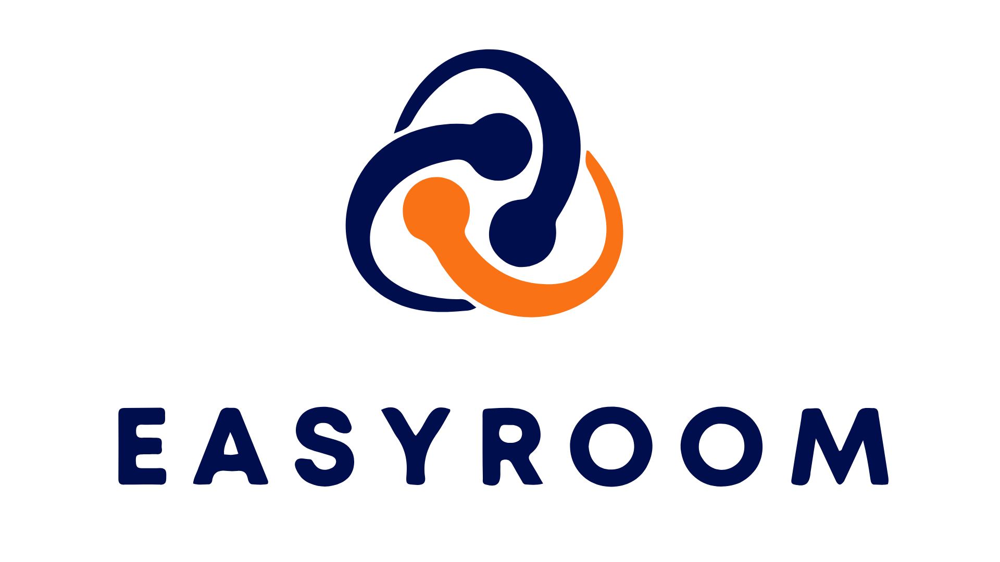

---

# Description

EasyRoom is a system developed to facilitate the management of the use of rooms in companies. With it, you can organize all information related to room reservations, users, events, resources, dates and times in an efficient and intuitive way.

# Main Features

Instructions on how to set up your development environment.

###

- [User Management](#user-management)
- [Room Management](#room-management)
- [Event Management](#event-management)

## User Management

#### Create User: 

The system allows you to create new users, providing name, e-mail and mandatory password. It also checks if the email is already in use and requires a secure password.

#### User Details:

The system displays an existing user's information including name, email, creation date and other relevant information using a unique ID.

#### Update User:

You can update a user's information, such as name, email and password. 
The system verifies if the new e-mail is already being used and imposes security criteria for the password.

#### Delete User:

The system allows deleting an existing user irreversibly, showing a confirmation step to avoid accidental deletions.

#### List Users:

The system presents a clear and organized list of all registered users, showing basic information, such as name and e-mail. From this list, you can drill down, edit, and delete users.

#### Search User:

You can search for users based on criteria such as name. The results are displayed in an organized way, similar to the list of users.

#### Authentication and Authorization:

The system provides authentication for secure login with username and password. In addition, it has authorization mechanisms to control access to functionalities, allowing specific actions only for authorized users.

(<a href="#main-features">top</a>)

## Room Management

#### Create Room:

The system allows the creation of new rooms, with mandatory fields such as name, maximum capacity and available resources.

#### Room Detail:

The system allows you to view information about an existing room, such as name, maximum capacity and available resources, through its unique identification.

#### Update Room:

The system allows updating the information of an existing room, such as name, maximum capacity and available resources.

#### Delete Room:

The system allows irreversible deletion of an existing room, with verification of associated events or reservations for reassignment or cancellation.

#### List Rooms: 

The system presents a clear and organized list of all registered rooms, showing basic information such as name, maximum capacity and available resources.

#### Room Search:

The system allows you to search rooms based on specific criteria, such as name, maximum capacity or available resources, displaying results in an organized way.

(<a href="#main-features">top</a>)

## Event management

#### Create Event:

The system allows the creation of events, with information such as name, date, time, room and organizer. Check room availability and capacity for attendees.

#### Detail Event:

The system displays information about an existing event, such as name, date, time, room and organizer.

#### Update Event:

The system allows updating information about an event, such as name, date, time, room and organizer. Check room availability and capacity for attendees.

#### Delete Event:

The system allows the deletion of an existing event, freeing up the associated room and offering options to notify participants.

#### List Events: 

The system presents an organized list of all registered events, showing basic information such as name, date, time and room.

#### Event Search:

The system allows you to search for events based on criteria such as name, date, room or organizer. The results are displayed in an organized way, similar to the event listing.

(<a href="#main-features">top</a>)

## Integrated Calendar

- View all room reservations in an intuitive calendar.
- Quickly check rooms booked on certain dates.
- Receive automatic notifications about reservations and changes.

(<a href="#main-features">top</a>)

## Reports and Statistics

- Generate reports on room usage, including frequency and duration of reservations.
- Get statistics to help you make decisions about room management.
- Identify usage patterns and optimize resource utilization.

(<a href="#main-features">top</a>)

## Initial setting

- Access the system using default administrator credentials.
- In the admin panel, create rooms, users and configure initial settings.
- Customize access permissions for each user.

(<a href="#main-features">top</a>)

# Technical and Installation Specifications

> Below we have two options of technical specifications to be accessed. Click on the option you want to access:

## [Frontend](frontend/README.md)

## [Backend](backend/README.md)

(<a href="#main-features">top</a>)

# Additional Documentation

For more detailed information on using and configuring EasyRoom, please refer to the complete documentation available in the "docs.pdf" file or visit our website at [www.easyroom.com.br](www.easyroom.com.br).

(<a href="#main-features">top</a>)

# Support

If you have any questions, problems or suggestions regarding EasyRoom, please contact our support team at easyroom@gmail.com. We are available to help you and constantly improve our system.

Thank you for choosing EasyRoom as your room management system. We hope it makes your everyday life simpler and more efficient.

(<a href="#main-features">top</a>)

# Contributors

This project exists thanks to the contribution of these people:

| Name | Function | Avatar |
| --- | --- | --- |
| <a href="https://github.com/kevinDsousa">Kevin Sousa</a> | Developer |   |
| <a href="https://github.com/joellacerda">Joel Lacerda</a> | Developer |  |
| <a href="https://github.com/christiansousadev">Christian Sousa</a> | Developer |  |
| <a href="https://github.com/enzogomezz">Enzo Gomez</a> | Developer |  |
| <a href="https://github.com/mikaelmonteirodev">Mikael Monteiro</a> |Developer |  |
| <a href="https://github.com/ivannaprata">Ivanna Prata</a> | Data Analytics |   |
| <a href="https://github.com/fabianopmelo">Fabiano Melo</a> | Data Analytics |  |
| <a href="https://github.com/gabrielsousarod">Gabriel Sousa</a>| Marketing|  |

(<a href="#main-features">top</a>)

# License

This project is MIT licensed, as found in the <a href="https://github.com/HackathonTeam05/Guardian/blob/main/LICENSE">LICENSE.md</a> file.

(<a href="#main-features">top</a>)

# Thanks

Thanks to everyone who helped in any way to make this project possible. You were very important for it to be developed. 👩🥳🙏🎉

(<a href="#main-features">top</a>)
