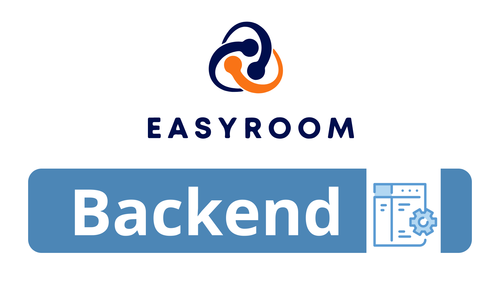

---

# Description

As informed in the main README of the project, here you will find all the necessary guidelines about the backend and database used in the development of the application.

 

# Getting Started

Instructions on how to set up your development environment.

###

- [Tools](#tools)
- [Prerequisites](#Prerequisites)
- [Installation](#installation)
- [NPM Packages](#install-npm-packages)
- [Storybook](#install-storybook)
- [Usage](#usage)

 

## Tools

This project uses for the Backend and Database:

(<a href="#getting-started">top</a>)

