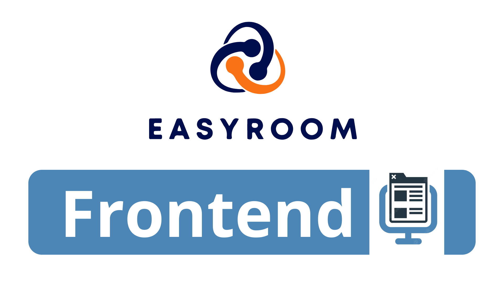
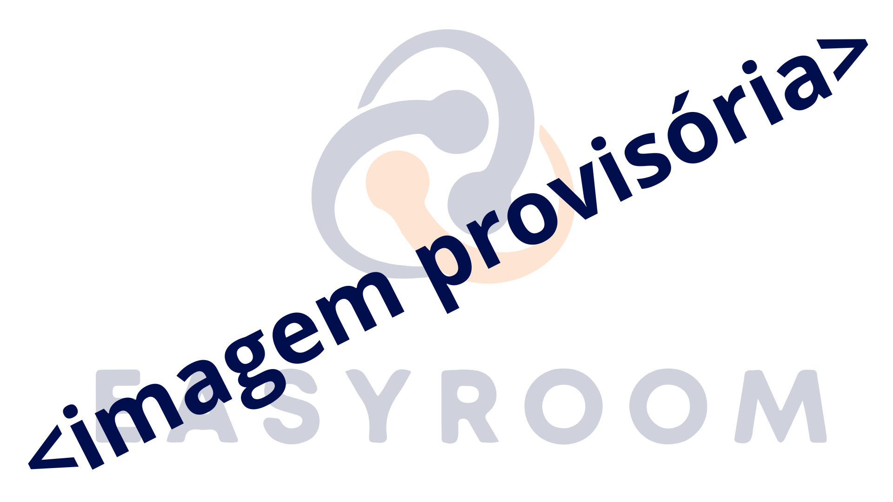

<p align="center" ></p>

---

# Description

As informed in the main README of the project, here you will find all the necessary guidance to run the application.

# Getting Started

<details>
<summary>
Instructions on how to set up your development environment.
</summary>

###

- [Tools](#tools)
- [Prerequisites](#Prerequisites)
- [Installation](#installation)
- [NPM Packages](#install-npm-packages)
- [Storybook](#install-the-storybook)
- [Usage](#usage)

</details>

## Tools

This project was created with:

<p>
<a href="https://code.visualstudio.com"></a>
<a href="https://ubuntu.com"></a>
<a href="https://react.dev"></a>
<a href="https://vitejs.dev"></a>
<a href="https://www.typescriptlang.org"></a>
<a href="https://tailwindcss.com"></a>
<a href="https://storybook.js.org"></a>
</p>

<p align="right">(<a href="#getting-started">top</a>)</p>

## Prerequisites

To install the tools in your local development environment, you will need to have NPM installed. To install the latest stable version of NPM, from the command line run:

```npm install npm@latest -g```

<p align="right">(<a href="#getting-started">top</a>)</p>

## Installation

Clone the repository:

```git clone https://github.com/HackathonTeam05/Guardian.git```

<p align="right">(<a href="#getting-started">top</a>)</p>

### Install NPM packages

Enter the command:

```npm install```

<p align="right">(<a href="#getting-started">top</a>)</p>

### Install Storybook

Use the Storybook CLI to install it in a single command. Run this inside the root directory of your existing project:

```npx storybook@latest init```

> Storybook will examine your project's dependencies during the installation process and provide you with the best configuration available.

Check that everything worked by running:

```npm run storybook```

> This command will run Storybook locally and display the address. Depending on your system configuration, it will automatically open the address in a new browser tab and you will be greeted by a welcome screen.

<p align="right">(<a href="#getting-started">top</a>)</p>

# Usage

To run the project locally, type the command:

```npm run dev```

The initial screen will open (as shown in the image below) and you will be able to use the system locally.

<p></p>

To see the features of the application [click here](/README.md).

<p align="right">(<a href="#getting-started">top</a>)</p>

# Version

The version of this application is ```version 1.0.0```

<p align="right">(<a href="#getting-started">top</a>)</p>

# Backend

To see the settings and other information of the [Backend, click here](/backend/README.md).

<p align="right">(<a href="#getting-started">top</a>)</p>